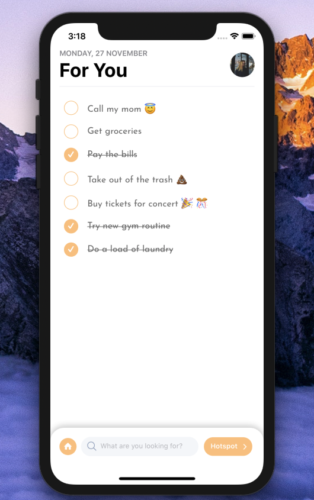

[](https://github.com/WrathChaos/react-native-bouncy-checkbox)


[](https://github.com/WrathChaos/react-native-bouncy-checkbox)


[](https://www.npmjs.com/package/react-native-bouncy-checkbox)
[](https://www.npmjs.com/package/react-native-bouncy-checkbox)

[](https://opensource.org/licenses/MIT)
[](https://github.com/prettier/prettier)

<p align="center">
  
  
</p>

## Installation

Add the dependency:

### React Native:

```ruby
npm i react-native-bouncy-checkbox
```

## Peer Dependencies

###### IMPORTANT! You need install them.

```
"react": ">= 16.x.x",
"react-native": ">= 0.55.x",
"react-native-vector-icons": ">= 6.6.0",
"react-native-dynamic-vector-icons": ">= 0.2.1"
```

## Import

```js
import BouncyCheckbox from "react-native-bouncy-checkbox";
```

# Usage 

## Basic (Default) Usage
```js
<BouncyCheckbox />
```


## Basic Usage

```jsx
<BouncyCheckbox
  isChecked
  textColor="#000"
  fillColor="red"
  text="Buy tickets for concert 🎉 🎊"
/>
```


## Advanced Custom Usage

```jsx
<BouncyCheckbox
  isChecked={false}
  textColor="#000"
  unfillColor="white"
  fontFamily="JosefinSans-Regular"
  iconComponent={
    <Image
      style={{ height: 10, width: 10 }}
      source={require("./assets/checkmark.png")}
    />
  }
  text="Custom Icon Example"
/>
```


### Configuration - Props

| Property      |   Type    |    Default     | Description                                                           |
| ------------- | :-------: | :------------: | --------------------------------------------------------------------- |
| text          |  string   | Call my mom 😇 | set the checkbox's text                                               |
| textColor     |   color   |    #757575     | change the text's color                                               |
| fontFamily    |  string   |    default     | set your own font family                                              |
| fontSize      |  number   |       16       | change the text's font size                                           |
| isChecked     |  boolean  |     false      | set the default checkbox value                                        |
| checkboxSize  |  number   |       25       | change the checkbox's size                                            |
| borderRadius  |  number   |     size/2     | change the checkbox's border radius if you do not want the circle one |
| borderColor   |   color   |    #f09f48     | change the checkbox's border color                                    |
| fillColor     |   color   |    #f09f48     | change the checkbox's filled color                                    |
| unfillColor   |   color   |  transparent   | change the checkbox's un-filled color when it's not checked           |
| iconComponent | component |      Icon      | set your own icon component                                           |
| onPress       | function  |      null      | set your own onPress functionality after the bounce effect            |


### Future Plans

- [x] ~~LICENSE~~
- [ ] Remove item feature
- [ ] Re-sort the list availability feature
- [ ] Write an article about the lib on Medium

## Author

FreakyCoder, kurayogun@gmail.com

## License

React Native Bouncy Checkbox is available under the MIT license. See the LICENSE file for more info.
