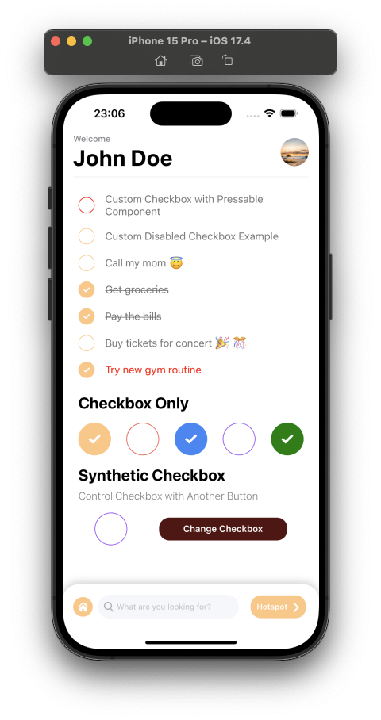

[](https://github.com/WrathChaos/react-native-bouncy-checkbox)

[](https://github.com/WrathChaos/react-native-bouncy-checkbox)

[](https://www.npmjs.com/package/react-native-bouncy-checkbox)
[](https://www.npmjs.com/package/react-native-bouncy-checkbox)

[](https://opensource.org/licenses/MIT)
[](https://github.com/prettier/prettier)

<table>
  <tr>
    <td align="center">
      
    </td>
    <td align="center">
      
    </td>
   </tr>
</table>

## Installation

Add the dependency:

<b>Zero Dependency</b>

### React Native

```ruby
npm i react-native-bouncy-checkbox
```

## Version 3.0.0 is here 🚀

- Typescript
- **Zero Dependency**
- **New** and More Customizable Animation
  - `bounceEffectIn`
  - `bounceEffectOut`
  - `bounceVelocityIn`
  - `bounceVelocityOut`
  - `bouncinessIn`
  - `bouncinessOut`
- Community Supported Stable Version

## Import

```js
import BouncyCheckbox from "react-native-bouncy-checkbox";
```

# Usage

## Basic Usage

```js
<BouncyCheckbox onPress={(isChecked: boolean) => {}} />
```

## Advanced Custom Usage

```jsx
<BouncyCheckbox
  size={25}
  fillColor="red"
  unfillColor="#FFFFFF"
  text="Custom Checkbox"
  iconStyle={{ borderColor: "red" }}
  innerIconStyle={{ borderWidth: 2 }}
  textStyle={{ fontFamily: "JosefinSans-Regular" }}
  onPress={(isChecked: boolean) => {}}
/>
```

### Configuration - Props

| Property             |   Type    |     Default      | Description                                                                                                                                |
| -------------------- | :-------: | :--------------: | ------------------------------------------------------------------------------------------------------------------------------------------ |
| text                 |  string   |    undefined     | set the checkbox's text                                                                                                                    |
| textComponent        | component |    undefined     | set the checkbox's text by a React Component                                                                                               |
| onPress              | function  |       null       | set your own onPress functionality after the bounce effect, callback receives the next `isChecked` boolean if disableBuiltInState is false |
| disableText          |  boolean  |      false       | if you want to use checkbox without text, you can enable it                                                                                |
| size                 |  number   |        25        | size of `width` and `height` of the checkbox                                                                                               |
| style                |   style   |     default      | set/override the container style                                                                                                           |
| textStyle            |   style   |     default      | set/override the text style                                                                                                                |
| iconStyle            |   style   |     default      | set/override the outer icon container style                                                                                                |
| innerIconStyle       |   style   |     default      | set/override the inner icon container style                                                                                                |
| isChecked            |  boolean  |      false       | set the default checkbox value                                                                                                             |
| fillColor            |   color   |     #f09f48      | change the checkbox's filled color                                                                                                         |
| unfillColor          |   color   |   transparent    | change the checkbox's un-filled color when it's not checked                                                                                |
| useNativeDriver      |  boolean  |       true       | enable/disable the useNativeDriver for animation                                                                                           |
| iconComponent        | component |       Icon       | set your own icon component                                                                                                                |
| checkIconImageSource |   image   |     default      | set your own check icon image                                                                                                              |
| ImageComponent       | component |      Image       | set your own Image component instead of RN's default Image                                                                                 |
| disableBuiltInState  |  boolean  |      false       | if you want to manually handle the `isChecked` prop and disable built in handling                                                          |
| textContainerStyle   | ViewStyle |     default      | set/override the text container style                                                                                                      |
| TouchableComponent   | Component | TouchableOpacity | set/override the main TouchableOpacity component with any Touchable Component like Pressable                                               |

### Animation Configurations

| Property          |  Type  | Default | Description                               |
| ----------------- | :----: | :-----: | ----------------------------------------- |
| bounceEffectIn    | number |   0.9   | change the bounce effect when press in    |
| bounceEffectOut   | number |    1    | change the bounce effect when press out   |
| bounceVelocityIn  | number |   0.1   | change the bounce velocity when press in  |
| bounceVelocityOut | number |   0.4   | change the bounce velocity when press out |
| bouncinessIn      | number |   20    | change the bounciness when press in       |
| bouncinessOut     | number |   20    | change the bounciness when press out      |

## Synthetic Press Functionality with Manual Check State

<div>
    
</div>

Please check the `example-manual-state` runable project to how to make it work on a real project.

<b><i>Be careful while using `disableBuiltInState` you MUST set the `isChecked` prop to use your own check state manually.</b></i> The `onPress` callback will **NOT** receive the next `isChecked` when `disableBuiltInState` is used.

Here is the basic implementation:

```jsx
import React from "react";
import {
  SafeAreaView,
  StyleSheet,
  Text,
  TouchableOpacity,
  View,
} from "react-native";
import BouncyCheckbox from "./lib/BouncyCheckbox";
import RNBounceable from "@freakycoder/react-native-bounceable";

const App = () => {
  let bouncyCheckboxRef: BouncyCheckbox | null = null;
  const [checkboxState, setCheckboxState] = React.useState(false);

  return (
    <SafeAreaView
      style={{
        flex: 1,
        alignItems: "center",
        justifyContent: "center",
      }}
    >
      <View
        style={{
          height: 30,
          width: 150,
          alignItems: "center",
          justifyContent: "center",
          borderRadius: 12,
          backgroundColor: checkboxState ? "#34eb83" : "#eb4034",
        }}
      >
        <Text
          style={{ color: "#fff" }}
        >{`Check Status: ${checkboxState.toString()}`}</Text>
      </View>
      <BouncyCheckbox
        style={{ marginTop: 16 }}
        ref={(ref: any) => (bouncyCheckboxRef = ref)}
        isChecked={checkboxState}
        text="Synthetic Checkbox"
        disableBuiltInState
        onPress={() => setCheckboxState(!checkboxState)}
      />
      <RNBounceable
        style={{
          marginTop: 16,
          height: 50,
          width: "90%",
          backgroundColor: "#ffc484",
          borderRadius: 12,
          alignItems: "center",
          justifyContent: "center",
        }}
        onPress={() => bouncyCheckboxRef?.onPress()}
      >
        <Text style={{ color: "#fff" }}>Synthetic Checkbox Press</Text>
      </RNBounceable>
    </SafeAreaView>
  );
};

const styles = StyleSheet.create({});

export default App;
```

## [React Native Bouncy Checkbox Group](https://github.com/WrathChaos/react-native-bouncy-checkbox-group)


We have also this library's checkbox group library as well :) Please take a look

## FAQ

<b>How to disable strikethrough?</b>

- Simply use the `textStyle` prop and set the `textDecorationLine` to `none`

```jsx
textStyle={{
  textDecorationLine: "none",
}}
```

<b>How to make square checkbox?</b>

- Simply use the `iconStyle` prop and set the `borderRadius` to `0`

```jsx
innerIconStyle={{
  borderRadius: 0, // to make it a little round increase the value accordingly
}}
```

### Future Plans

- [x] ~~LICENSE~~
- [x] ~~Typescript Challange!~~
- [x] ~~Version 2.0.0 is alive 🥳~~
- [x] ~~Synthetic Press Functionality~~
- [x] ~~Disable built-in check state~~
- [x] ~~React Native Bouncy Checkbox Group Library Extension~~
- [x] ~~New Animation and More Customizable Animation~~
- [x] ~~Version 3.0.0 is alive 🚀~~
- [ ] Better Documentation | Separation of Documentation
- [ ] Write an article about the lib on Medium

## Author

FreakyCoder, kurayogun@gmail.com

## License

React Native Bouncy Checkbox is available under the MIT license. See the LICENSE file for more info.
