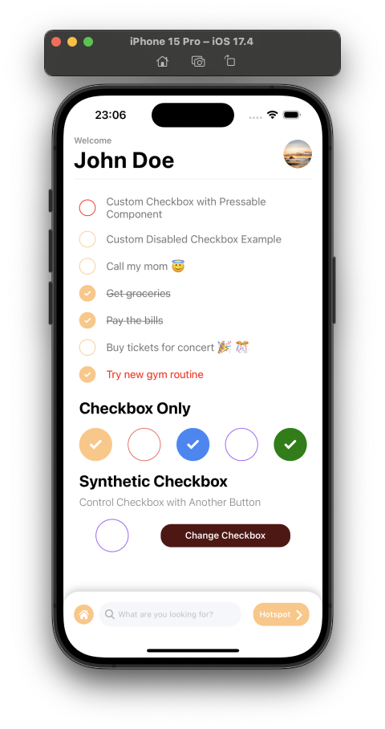

[](https://github.com/kuraydev/react-native-bouncy-checkbox)

[](https://github.com/kuraydev/react-native-bouncy-checkbox)

[](https://github.com/kuraydev/react-native-bouncy-checkbox/actions/workflows/ci.yml)
[](https://www.npmjs.com/package/react-native-bouncy-checkbox)
[](https://www.npmjs.com/package/react-native-bouncy-checkbox)


[](https://opensource.org/licenses/MIT)
[](https://github.com/prettier/prettier)

<table>
  <tr>
    <td align="center">
      
    </td>
    <td align="center">
      
    </td>
   </tr>
</table>

A fully customizable, animated **bouncy checkbox** for React Native. It is a pure
JavaScript component (`Animated` spring + `Pressable`) with **zero runtime
dependencies**, so it works out of the box on iOS, Android, the
[New Architecture (Fabric)](#-new-architecture--expo--web), `react-native-web`,
and Expo. Ships with TypeScript types.

## Installation

```sh
npm install react-native-bouncy-checkbox
# or
yarn add react-native-bouncy-checkbox
```

No native linking, no pods, no extra dependencies. 🥳

## Import

```tsx
import BouncyCheckbox from "react-native-bouncy-checkbox";
```

## Usage

### Basic

```tsx
<BouncyCheckbox onPress={(isChecked: boolean) => console.log(isChecked)} />
```

### Customized

```tsx
<BouncyCheckbox
  size={25}
  fillColor="red"
  unFillColor="#FFFFFF"
  text="Custom Checkbox"
  iconStyle={{ borderColor: "red" }}
  innerIconStyle={{ borderWidth: 2 }}
  textStyle={{ fontFamily: "JosefinSans-Regular" }}
  onPress={(isChecked: boolean) => console.log(isChecked)}
/>
```

### Uncontrolled with an initial value

Use `defaultChecked` to start checked while still letting the component manage
its own state:

```tsx
<BouncyCheckbox defaultChecked text="Subscribe" onPress={console.log} />
```

### Fully controlled state

To control the checked state from the outside, set `useBuiltInState={false}` and
drive it with the `isChecked` prop:

```tsx
const [checked, setChecked] = React.useState(false);

<BouncyCheckbox
  isChecked={checked}
  useBuiltInState={false}
  fillColor="green"
  text="Controlled Checkbox"
  onPress={() => setChecked((prev) => !prev)}
/>;
```

> In controlled mode the `onPress` callback receives the **current** `isChecked`
> value (before your update), so flip your own state inside it.

## Props

> ⚠️ Note the casing: the un-checked background prop is **`unFillColor`** (capital
> `F`).

| Prop                   | Type                  | Default            | Description                                                                              |
| ---------------------- | --------------------- | ------------------ | ---------------------------------------------------------------------------------------- |
| `onPress`              | `(checked) => void`   | `undefined`        | Called after the bounce; receives the next `checked` value (built-in mode).              |
| `onLongPress`          | `(checked) => void`   | `undefined`        | Same as `onPress`, for long presses.                                                     |
| `isChecked`            | `boolean`             | `undefined`        | Controlled checked value. Pair with `useBuiltInState={false}`.                           |
| `defaultChecked`       | `boolean`             | `false`            | Initial checked value for an **uncontrolled** checkbox.                                  |
| `useBuiltInState`      | `boolean`             | `true`             | When `false`, the component does not manage its own state — you drive it via `isChecked`. |
| `text`                 | `string`              | `undefined`        | Label text shown next to the checkbox.                                                   |
| `textComponent`        | `ReactNode`           | `undefined`        | Render a custom label instead of `text`.                                                 |
| `disableText`          | `boolean`             | `false`            | Hide the label entirely.                                                                 |
| `size`                 | `number`              | `25`               | Width/height of the checkbox.                                                            |
| `fillColor`            | `string`              | `#ffc484`          | Background color when checked.                                                           |
| `unFillColor`          | `string`              | `transparent`      | Background color when unchecked.                                                         |
| `iconComponent`        | `ReactNode`           | `undefined`        | Replace the default check icon.                                                          |
| `checkIconImageSource` | `ImageSourcePropType` | bundled check icon | Custom check icon image.                                                                 |
| `ImageComponent`       | `ComponentType`       | `Image`            | Replace RN's `Image` (e.g. `FastImage`) for the check icon.                              |
| `TouchableComponent`   | `ComponentType`       | `Pressable`        | Replace the outer touchable.                                                             |
| `style`                | `ViewStyle`           | —                  | Container style.                                                                         |
| `iconStyle`            | `ViewStyle`           | —                  | Outer icon container style.                                                              |
| `innerIconStyle`       | `ViewStyle`           | —                  | Inner icon container style (border, radius…).                                            |
| `iconImageStyle`       | `ImageStyle`          | `{ width: 10, height: 10 }` | Style for the check icon image.                                                |
| `textStyle`            | `TextStyle`           | —                  | Label text style.                                                                       |
| `textContainerStyle`   | `ViewStyle`           | —                  | Label container style.                                                                   |
| `testID`               | `string`              | `undefined`        | Test identifier on the touchable.                                                        |

All remaining `Pressable` props (e.g. `disabled`, `accessibilityLabel`, `hitSlop`)
are forwarded to the underlying `TouchableComponent`.

### Animation props

| Prop                | Type     | Default | Description                            |
| ------------------- | -------- | ------- | -------------------------------------- |
| `bounceEffectIn`    | `number` | `0.9`   | Scale on press in.                     |
| `bounceEffectOut`   | `number` | `1`     | Scale on press out.                    |
| `bounceVelocityIn`  | `number` | `0.1`   | Spring velocity on press in.           |
| `bounceVelocityOut` | `number` | `0.4`   | Spring velocity on press out.          |
| `bouncinessIn`      | `number` | `20`    | Spring bounciness on press in.         |
| `bouncinessOut`     | `number` | `20`    | Spring bounciness on press out.        |

## Imperative API (ref)

You can trigger a "synthetic" press from outside the component using a ref. This
is handy when another button should toggle the checkbox.

```tsx
import React, { useRef } from "react";
import { Pressable, Text, View } from "react-native";
import BouncyCheckbox, {
  BouncyCheckboxHandle,
} from "react-native-bouncy-checkbox";

const Example = () => {
  const checkboxRef = useRef<BouncyCheckboxHandle>(null);

  return (
    <View>
      <BouncyCheckbox
        ref={checkboxRef}
        text="Synthetic Checkbox"
        onPress={(checked) => console.log("checked:", checked)}
      />
      <Pressable onPress={() => checkboxRef.current?.onCheckboxPress()}>
        <Text>Toggle from outside</Text>
      </Pressable>
    </View>
  );
};
```

The ref handle exposes:

```ts
interface BouncyCheckboxHandle {
  onCheckboxPress: () => void;
  onCheckboxLongPress: () => void;
}
```

<div>
    
</div>

## Accessibility

The checkbox renders with `accessibilityRole="checkbox"` and
`accessibilityState={{ checked }}` by default, so screen readers and
`react-native-web` announce it correctly. You can override either via the usual
accessibility props.

## ⚡ New Architecture / Expo / Web

This library is **pure JavaScript** — it uses only `View`, `Text`, `Image`,
`Animated`, and `Pressable`. There are no native modules or Fabric components, so
it is automatically compatible with:

- ✅ The **New Architecture (Fabric / TurboModules)** — nothing to enable.
- ✅ **Expo** (managed and bare) — no config plugin required.
- ✅ **react-native-web**.

## FAQ

**How do I disable the strikethrough on the label?**

```tsx
textStyle={{ textDecorationLine: "none" }}
```

**How do I make a square checkbox?**

```tsx
innerIconStyle={{ borderRadius: 0 }}
```

## Related

- [React Native Bouncy Checkbox Group](https://github.com/kuraydev/react-native-bouncy-checkbox-group) — group/list variant.

## Contributing

Contributions are welcome! Please read [CONTRIBUTING.md](./CONTRIBUTING.md) and
note the backwards-compatibility rules before opening a PR. See
[CHANGELOG.md](./CHANGELOG.md) for the release history.

## Credits

Demo background photo by
<a href="https://unsplash.com/@fakurian">Milad Fakurian</a> on
<a href="https://unsplash.com/photos/blue-orange-and-yellow-wallpaper-E8Ufcyxz514">Unsplash</a>.

## Author

Kuray (FreakyCoder), kurayogun@gmail.com

## License

React Native Bouncy Checkbox is available under the MIT license. See the
[LICENSE](./LICENSE) file for more info.
